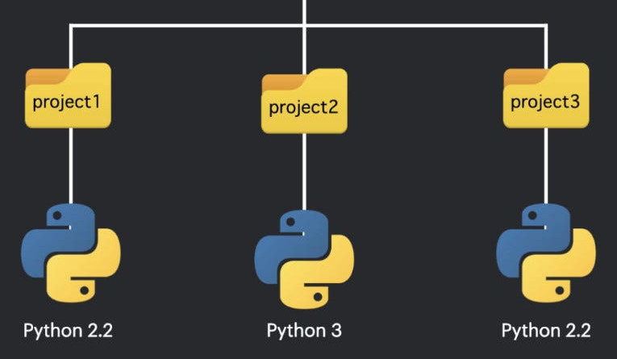
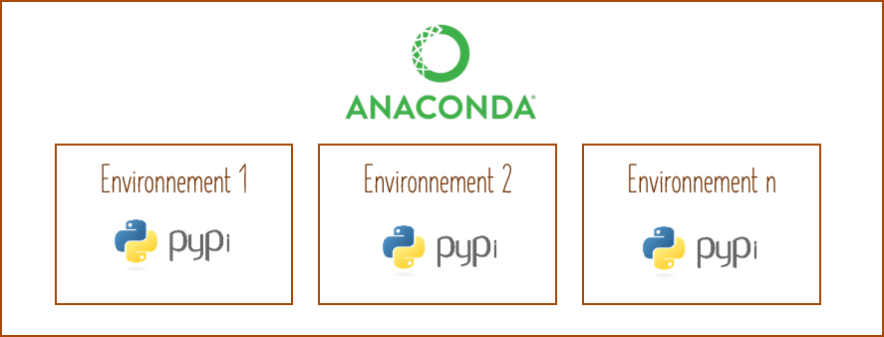
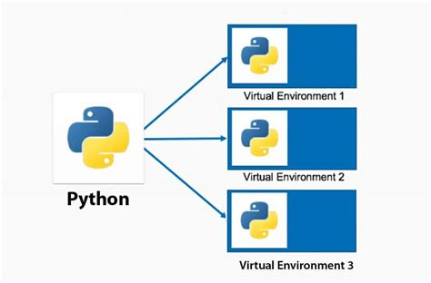
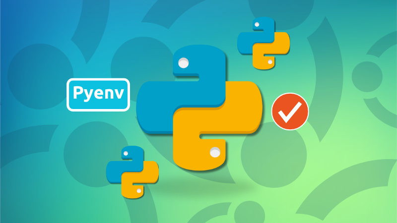
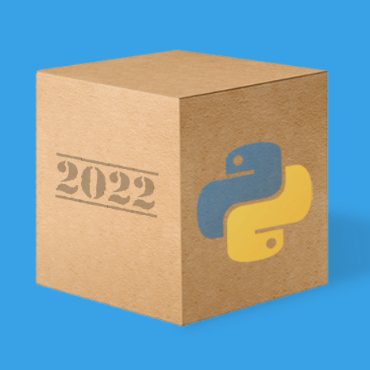
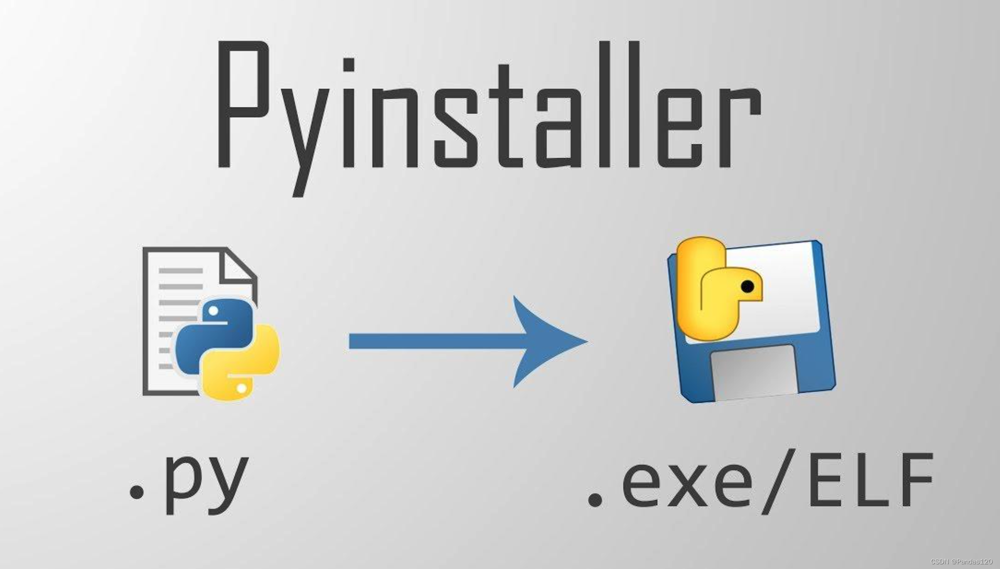
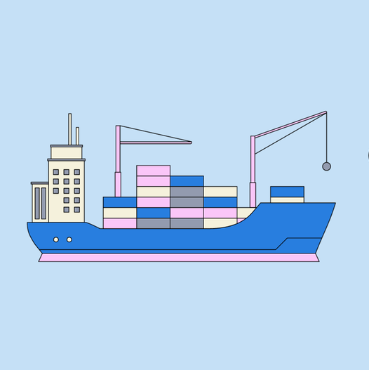
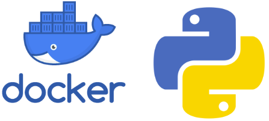

# Environnements virtuels, empaquetage, conteneurs Dockers

Le projet teste l'utilisation de solutions pour reproduire un projet en Python 2.7. Ce dernier est dans le dépôt gothon???. Ce dépôt-ci est un **sommaire des solutions** testées. Le cas de figure pourrait être un autre projet en Python 3.

IMG compo

## Mise en place et structure

### Créer des environnements virtuels

Un environnement permet de contenir un projet avec une version de Python et des versions de modules indépendants. Le projet, qui compte des codes sources, des fichiers, des données, des images, etc., est isolé du reste de l'ordinateur.

Il est possible d'exporter ce projet comme un dossier compressé. Le projet peut aussi transiter par un dépôt de données (GitHub, par exemple). Il suffit d'importer ou de télécharger le projet, de reproduire l'environnement du projet sur un autre ordinateur -- version de Python et versions de modules indépendants -- pour réimplanter le projet.

**Cas 1 : Conda env (cas de base)**

Conda est associé à la distribution Anaconda. Il faut installer cette distribution qui comprend des logiciels et un environnement virtuel base avec une version de l'interpréteur Python et des modules indépendants (répertoriés avec requirements.txt; fichier obtenu par `pip freeze`). Conda permet de créer d'autres environnements.

Avantages : La solution fonctionne avec tous projets Python; même avec la version 2.7 de l'interpréteur.

Inconvénients : Il faut installer Anaconda pour bénéficier des commandes Conda, même si on ne cherche qu'à créer un environnement sans avoir besoin de tout ce qu'Anaconda peut offrir d'autre. On peut minimiser avec Miniconda.

**Cas 2 : venv**

C'est un module Python standard. Il vient avec l'installation d'une version de l'interpréteur Python.

Avantages : La solution fonctionne comme Conda env, mais sans avoir à installer une lourde distribution comme Anaconda comprenant un environnement de base (une version de l'interpréteur Python et des modules indépendants, des logiciels).

Inconvénients : On ne peut installer un autre interpréteur Python que celui du système. Ce qui ne permet pas de rendre un projet avec la version 2.7 de l'interpréteur Python ou une autre version. Chaque projet de distingue par ses versions de modules indépendants et ses actifs. Solution obsolète.

**Cas 3 : pyenv et Poetry**

pyenv permet d'installer un environnement et de choisir un interpréteur Python. pyenv permet de basculer facilement entre différentes versions de l'interpréteur Python.

Poetry gère les dépendances du projet (les modules indépendants). Il facilite l'empaquetage et la publication du projet. Il offre une solution de rechange au fichier requirements.txt obtenu par `pip freeze` avec les fichiers pyproject.toml et poetry.lock. Le fichier pyproject.toml va plus loin que le fichier requirements.txt, car il comporte aussi un template du projet avec le nom du projet, la version du projet, la licence utilisée, etc. Sans le pyproject.toml, il faut avoir la présence d'esprit d'ajouter ces renseignements au README.

|   |   |
|---|---|
|  |  |

Avantages : La solution fonctionne comme Conda env, mais sans avoir à installer une lourde distribution comme Anaconda comprenant un environnement de base (une version de l'interpréteur Python et des modules indépendants, des logiciels). La solution fonctionne avec tous projets Python; même avec la version 2.7 de l'interpréteur.

Inconvénients : La solution est plus complexe à gérer que Conda env. Les fichiers pyproject.toml et poetry.lock ne sont pas une grande amélioration par rapport au fichier requirements.txt obtenu par `pip freeze` et largement répandu pour la gestion de projets Python.

**Cas 4 : pyenv et uv**

pyenv permet d'installer un environnement et de choisir un interpréteur Python. pyenv permet de basculer facilement entre différentes versions de l'interpréteur Python.

uv est un remplacement moderne et ultra rapide de Pip, Python Python venv et une solution de rechange à Poetry et Conda.

|   |   |
|---|---|
|  |  |

uv gère les dépendances du projet (les modules indépendants) et vise à remplacer pip, pip-tools et pipx. Il peut aussi remplacer venv, mais il ne peut créer un environnement avec un interpréteur Python 2 (c'est le pourquoi de pyenv). Il facilite l'empaquetage et la publication du projet. Il offre une solution de rechange au fichier requirements.txt obtenu par `pip freeze` avec le fichier pyproject.toml obtenu par `uv freeze`. Le fichier pyproject.toml va plus loin que le fichier requirements.txt, car il comporte aussi un template du projet avec le nom du projet, la version du projet, la licence utilisée, etc. Sans le pyproject.toml, il faut avoir la présence d'esprit d'ajouter ces renseignements au README. Les commandes uv sont plus riches que les commandes Pip. Par exemple, la commande `uv init` crée à la fois le pyproject.toml, le .gitignore, le README.md et un code source Python de départ. Contrairement à Poetry et son fichier poetry.lock, le fichier requirements.lock d'uv est facultatif.

Avantages : La solution fonctionne comme Conda env, mais sans avoir à installer une lourde distribution comme Anaconda comprenant un environnement de base (une version de l'interpréteur Python et des modules indépendants, des logiciels). La solution fonctionne avec tous projets Python; même avec la version 2.7 de l'interpréteur. Équivalent à pyenv et Poetry, mais plus rapide que toutes les autres solutions. Plus riche en commandes. Les fichiers pyproject.toml et requirements.lock, avec les commandes uv, sont une grande amélioration par rapport au fichier requirements.txt obtenu par `pip freeze`. Il existe des commandes uv pour ajouter des tests de développements (et d'inclure les tests dans pyproject.toml). Il existe des commandes uv pour publier le projet comme une distribution.

Inconvénients : La solution est plus complexe à gérer que Conda env. Cette sophistication est prévue conçu pour déployer beaucoup de projets, en plusieurs versions; pour déployer de gros projets impliquant des tests et pour assurer un suivi serré grâce aux templates du projet. Les commandes uv plus avancées ne prennent pas en charge Python 2.

### Empaqueter comme un logiciel

L'empaquetage natif (standalone package) crée un exécutable qui inclut une version de l'interpréteur Python et toutes les dépendances (modules indépendants) dans un seul fichier exécutable comme un logiciel, permettant l'exécution directe sur le système d'exploitation cible (OS).

Il est possible d'exporter le fichier exécutable. Le projet peut aussi transiter par un dépôt de données (GitHub, par exemple). Il suffit d'importer ou de télécharger le fichier et de lancer son exécution, mais sans pouvoir reproduire le projet sur un autre ordinateur.

**Cas 5 : PyInstaller**

Par rapport à cx_Freeze, py2exe, PyInstaller est le plus activement maintenu et le plus recommandé, en particulier pour les versions plus anciennes de Python.

Avantages : PyInstaller est une solution de rechange aux environnements virtuels pour les projets simples en Python 3 et convient aux vieux projets en Python 2.

Inconvénients : Pour exécuter PyInstaller sur une machine Windows, l'utilisateur double-clique sur un fichier EXE qui supporte bien Python 2.7. Cependant, le .EXE n'est pas "propre" (il s'agit d'un dossier temporaire décompressé à l'exécution). Pour exécuter PyInstaller sur une machine Linux, l'utilisateur double-clique sur un EXE qui supporte bien Python 2.7. Cependant, le binaire compilé sur Ubuntu 24.04, par exemple, fonctionnera sur certaines des anciennes versions d'Ubuntu, mais non sur de plus vieilles versions. Le binaire ne fonctionnera probablement pas sur d'autres distributions Linux (à tester). Solution risquée.

### Conteneurs

Un conteneur est une amélioration plus sophistiquée des environnements virtuels et de l'empaquetage. Le concepteur du conteneur comme l'utilisateur du conteneur doivent utiliser un logiciel de conteneur.

**Cas 6 : Docker**

Pour exécuter un projet Python sur un serveur ou dans un environnement de déploiement structuré (même pour un projet en Python 2.7), Docker est une bonne approche.

À noter que Docker a aussi été tester sur un projet en Python 3. Ce dernier est dans le dépôt webpy_py311.???

Il est possible d'exporter une image du conteneur; comme un fichier. Le projet peut aussi transiter par un dépôt de données (GitHub, par exemple). Il suffit d'importer ou de télécharger l'image et de lancer son exécution dans le logiciel de conteneur, sans pouvoir reproduire ou modifier le projet. Le concepteur reste le mettre d'oeuvre qui construit l'image et la partage.

Il est possible d'exporter le projet qui permet de construire une image; comme un dossier compressé. Le projet peut aussi transiter par un dépôt de données (GitHub, par exemple). Il faut que le concepteur partage le projet source (le dossier contenant les fichiers, le Dockerfile, etc.) pour permettre à un utilisateur d'ouvrir le projet, de le reproduire, de le modifier, de le reconstruire et de le repartager.

Avantages : Docker est une solution de rechange aux environnements virtuels et à l'empaquetage. La solution fonctionne avec tous projets Python; même avec la version 2.7 de l'interpréteur. La conteneurisation est plus robuste pour garantir que le projet (avec son interpréteur Python, ses modules indépendants et ses fichiers) fonctionne parfaitement sur n'importe quel serveur ou machine où Docker est installé.

Inconvénients : La solution est plus complexe à gérer que des environnements virtuels ou l'empaquetage. Cette sophistication est prévue conçu pour déployer beaucoup de projets, en plusieurs versions; pour déployer de gros projets impliquant des tests et pour assurer un suivi serré comme le permet uv.

### Conclusion

Le cas de figure utilisé pour les tests est simple. Il requiert peu de modules indépendants. Selon le projet, les préférences :

- Conda pour des projets simples.
- pyenv et uv pour des projets complexes où se multiplient les versions, les modules indépendants, les coéquipiers, etc.
- Docker pour la même raison que pyenv et uv.
- Le choix entre un environnement virtuel ou un conteneur relève de bien d'autres facteurs.
